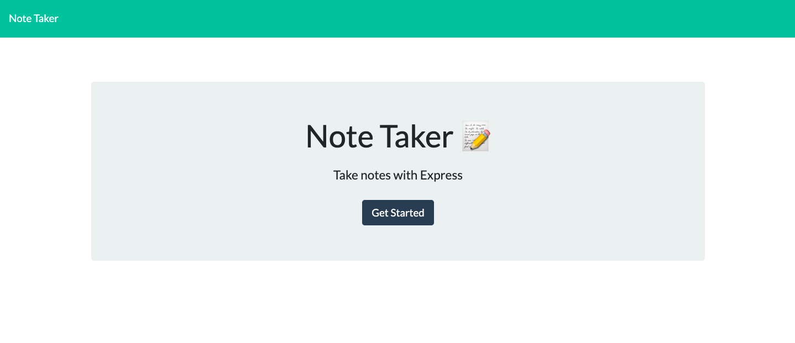
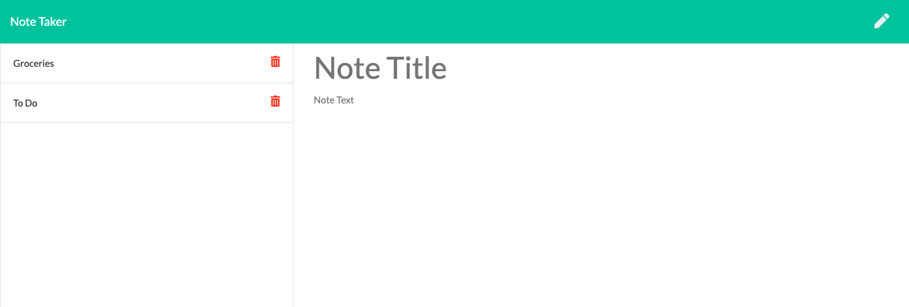

# Note Taker

## Description 
This project uses express to create a server for a note taker app. The other technologies used are HTML, CSS, Javascript and Node. 

## Demo

## Table of Contents 
    
* [Installation](#installation)
* [Usage](#usage)
* [License](#license)
* [Contributing](#contributing)
* [Tests](#tests)
* [Questions](#questions)
    
    
## Installation Instructions 
To install necessary dependancies run thr following command:
npm i
To start the server run the following command:
node server.js
## Usage 
This application is intened to take in and save notes based on user input. 
## License 
This project is licensed with MIT
## Contributors 
Kirsten Nelson
## Tests 
No tests needed for this application
## Questions 
 For questions contact Kirsten Nelson at https://github.com/kirmarnel 